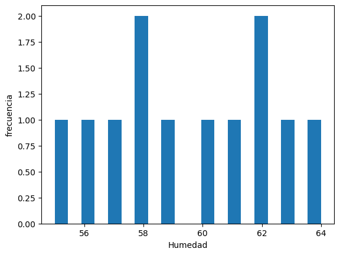
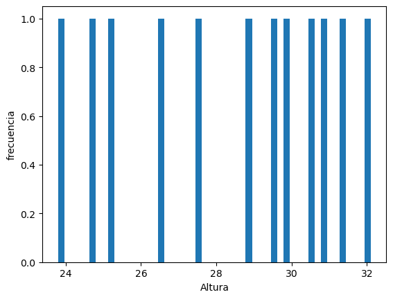
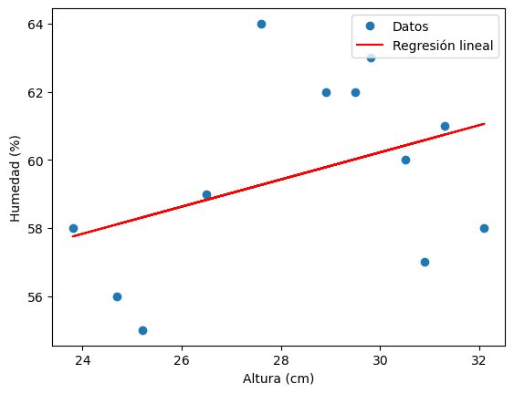

# Trabajo Final Dardo Dallachiesa

## "Manejo de Datos en Biología Computacional. Herramientas de Estadística"

Lo primero que hago es utilizar el siguiente codigo para importar todas la biblotecas


````python 
import scipy.stats as ss
import statsmodels.stats.power as smp
import numpy as np
from statsmodels.stats.power import TTestIndPower
import pandas as pd
import matplotlib.pyplot as plt
from scipy.stats import chi2_contingency
from scipy.stats import linregress
````


Luego el siguiente codigo es para la lectura y "show" de la tabla

````python
path = "C:/Users/dardo/Desktop/Curso_estadistica/Trabajo_Final/Trabajo_Final_Dallachiesa/Tabla_Plantas.csv"
legumes = pd.read_csv(path,sep=';')
legumes
````
## Descripción

Las variables medidas en la muestra de leguminosas incluyen:

1) Leguminosa: Variable categórica que identifica el tipo de leguminosa en cada muestra. En la tabla, se utilizan las categorías *Glyicine max*, *Phaseolus vulgaris* y *Medicago truncatula* para representar diferentes tipos de leguminosas.

2) Población: Variable discreta que indica la cantidad de leguminosas en cada muestra.

3) Altura (cm): Variable continua que representa la altura de las leguminosas en centímetros. La altura es una medida cuantitativa que se utiliza para evaluar el crecimiento de las plantas.

4) Temperatura (°C): Variable continua que indica la temperatura en grados Celsius en el entorno donde se cultivaron las leguminosas. La temperatura es una medida cuantitativa que puede influir en el crecimiento y desarrollo de las plantas.

5) Humedad (%): Variable continua que representa el nivel de humedad relativa donde se cultivaron las leguminosas, expresado en porcentaje. La humedad es una medida cuantitativa que puede afectar el crecimiento de las plantas.

6) Crecimiento: Variable categórica que indica si es el crecimiento es óptimo o deficiente. 

Se ha establecido que las plantas con una altura igual o superior a 28 cm se consideran de crecimiento óptimo, 
mientras que las plantas con una altura inferior a 28 cm se consideran de crecimiento deficientes.

## Hipotesis

Se plantea la siguiente hipotesis:

**La humedad tiene una correlación positiva con la altura de las leguminosas.**

Para probar esta hipótesis, se busca establecer si existe una relación significativa entre la variable de humedad 
y la variable de altura en las leguminosas. 
La hipótesis asume que a medida que aumenta el nivel de humedad, también aumentará la altura de las leguminosas.
Los pasos para llevar a cabo esta prueba son los siguientes:

Establecer las hipótesis nula (H0) y alternativa (H1):

H0: No hay correlación entre la humedad y la altura de las leguminosas.

H1: Existe una correlación positiva entre la humedad y la altura de las leguminosas.

## Histogramas

Se obtuvieron las siguientes distribuciones de frecuencia de las variables humedad y altura 







## Cálculo del tamaño muestral

Se calcula el tamaño muestral necesario para las variables de altura y humedad. 

***En ambos casos el tamaño muestral necesario es 3***

## Media y desviación estandar

A continuación se muestra el codigo y resultados del calculo de media y desviación estandar para las variables altura y humedad

````python 
# Calcular la media y la desviación estándar de altura
datos1= np.mean(legumes['Altura (cm)'])
datos_std1 = np.std(legumes['Altura (cm)'], ddof=1)
print (datos1)
print (datos_std1)
````
media altura: 28.400000000000002

desviación estandar altura: 2.7882871901124995


````python
# Calcular la media y la desviación estándar de humedad
datos2= np.mean(legumes['Humedad (%)'])
datos_std2 = np.std(legumes['Humedad (%)'], ddof=1)
print (datos2)
print (datos_std2)
````
media humedad: 59.583333333333336


desviación estandar humedad: 2.874917653629668

## Test

Se aplica el *normal test* para las dos variables. Esto sirve para determinar si las dos variables siguen una distribución normal. Se utiliza para verificar la suposición de normalidad en el análisis estadístico paramétrico.

Ademas, se aplica el *t test* que es una prueba estadística utilizada para determinar si hay diferencias significativas entre las medias de dos variables. Es una prueba paramétrica que produce un valor de *t-statistic* y un *p value* asociado.
Se realiza el *t test* para dos muestras independientes.


El resultado del normal test es el siguiente para altura y humedad respectivamente:
````
NormaltestResult(statistic=1.8910785976421935, pvalue=0.38847001297963046)
ShapiroResult(statistic=0.9330066442489624, pvalue=0.41307348012924194)


NormaltestResult(statistic=1.1365060230180863, pvalue=0.5665142686180424)
ShapiroResult(statistic=0.9658291339874268, pvalue=0.8626019954681396)
````


El resultado del t test para altura y humedad es el siguiente: 

````
Ttest_indResult(statistic=-13.53353895715043, pvalue=0.00016243814853461255)
````


***Los resultados del normal test indican que no se tiene evidencia suficiente para rechazar la hipótesis nula de que los datos siguen una distribución normal. Por lo tanto se puede asumir una distribución normal.***

***Ademas, segun los resultados del t test, hay una diferencia significativa entre las medias de las dos muestras. La media de la primera muestra es significativamente menor que la media de la segunda muestra. Por lo tanto, el resultado indica que hay una diferencia estadísticamente significativa entre las medias de las dos muestras y que la media de la primera muestra es significativamente menor que la media de la segunda muestra.*** 

## Tabla de contingencia

Se generó una tabla de contingencia a partir de los datos de altura y crecimiento tomando como punto de corte altura igual a 28 centimetros. Si ese valor es igual o mayo, el crecimiento de la planta es óptimo. 

### Tabla de contingencia

````
Crecimiento  False  True 
Altura (cm)              
False            4      1
True             0      7
Empty DataFrame
Columns: [False, True]
Index: []
````
A continuación se aplica el test de *chi cuadrado*. Sirve como prueba prueba estadística para determinar si existe una asociación significativa entre dos variables y evaluar si las diferencias observadas son significativas o si pueden ser atribuidas al azar.

Resultado del test: 

Chi cuadrado: 5.185714285714285

Valor p: 0.022773309501244822

***Estos resultados indican que hay una diferencia significativa entre las variables en la tabla de contingencia.***

## Regresión lineal

Se evalua el ajuste de la recta de regresión y la relación entre las variables Altura y Humedad para ver como es la correlación entre estas dos variables.

Los resultados de la regresion y el grafico de la recta se muestran a continuación:

````
(r): 0.38672191231018677
P value: 0.21429805054468382
Coeficiente de regresión (pendiente): 0.3987371375116933
Error estándar: 0.3006846923850679
````




***El valor del coeficiente de regresión (r) indica una correlación positiva moderada entre la humedad y la altura. Esto significa que a medida que la humedad aumenta, es probable que la altura de las plantas también aumente, pero la relación no es muy fuerte. El P value indica que la correlación observada puede ser el resultado del azar y no ser estadísticamente significativa.***

