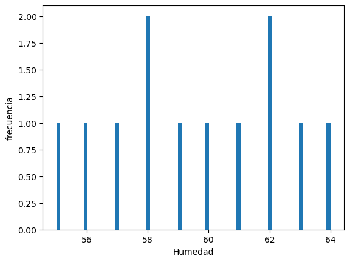
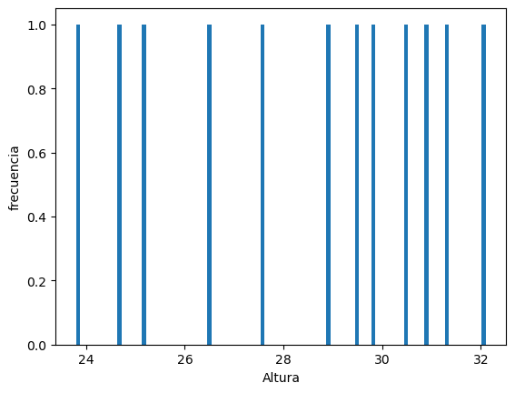

# Trabajo Final Dardo Dallachiesa

## "Manejo de Datos en Biología Computacional. Herramientas de Estadística"

Lo primero que hago es utilizar el siguiente codigo para importar todas la biblotecas


````python 
import scipy.stats as ss
import statsmodels.stats.power as smp
import numpy as np
from statsmodels.stats.power import TTestIndPower
import pandas as pd
import matplotlib.pyplot as plt
from scipy.stats import chi2_contingency
from scipy.stats import linregress
````


Luego el siguiente codigo es para la lectura y "show" de la tabla

````python
path = "C:/Users/dardo/Desktop/Curso_estadistica/Trabajo_Final/Trabajo_Final_Dallachiesa/Tabla_Plantas.csv"
legumes = pd.read_csv(path,sep=';')
legumes
````
## Descripción

Las variables medidas en la muestra de leguminosas incluyen:

1) Leguminosa: Es una variable categórica que identifica el tipo de leguminosa en cada muestra. En la tabla, se utilizan las categorías Glyicine max, Phaseolus vulgaris y Medicago truncatula para representar diferentes tipos de leguminosas.

2) Población: Es una variable discreta que indica la cantidad de leguminosas en cada muestra.

3) Altura (cm): Es una variable continua que representa la altura de las leguminosas en centímetros. La altura es una medida cuantitativa que se utiliza para evaluar el crecimiento vertical de las plantas.

4) Temperatura (°C): Es una variable continua que indica la temperatura en grados Celsius en el entorno donde se cultivaron las leguminosas. La temperatura es una medida cuantitativa que puede influir en el crecimiento y desarrollo de las plantas.

5) Humedad (%): Es una variable continua que representa el nivel de humedad relativa en el entorno donde se cultivaron las leguminosas, expresado en porcentaje. La humedad es una medida cuantitativa que puede afectar el crecimiento y la salud de las plantas.

Se ha establecido que las plantas con una altura igual o superior a 28 cm se consideran de crecimiento óptimo, 
mientras que las plantas con una altura inferior a 28 cm se consideran de crecimiento deficientes.

## Hipotesis

Se plantea la siguiente hipotesis:

**La humedad tiene una correlación positiva con la altura de las leguminosas.**

Para probar esta hipótesis, se busca establecer si existe una relación significativa entre la variable de humedad 
y la variable de altura en las leguminosas. 
La hipótesis asume que a medida que aumenta el nivel de humedad, también aumentará la altura de las leguminosas.
Los pasos para llevar a cabo esta prueba son los siguientes:

Establecer las hipótesis nula (H0) y alternativa (H1):

H0: No hay correlación entre la humedad y la altura de las leguminosas.

H1: Existe una correlación positiva entre la humedad y la altura de las leguminosas.

## Histogramas

Se obtuvieron las siguientes distribuciones de frecuencia de las variables humedad y altura 







Calculo del tamaño muestral

````python
effect_size = abs((legumes['Altura (cm)'].max()-legumes['Altura (cm)'].min())/legumes['Altura (cm)'].std())   
# diferencia de medias esperada
alpha = 0.05      # nivel de significancia
power = 0.8       # potencia
ratio = 1         # relación entre los tamaños de las muestras
n1 = smp.tt_ind_solve_power(effect_size=effect_size, alpha=alpha, power=power, ratio=ratio)
print("El tamaño muestral necesario es:", round(n))
````
El tamaño muestral necesario es: 3


````python
effect_size = abs((legumes['Humedad (%)'].max()-legumes['Humedad (%)'].min())/legumes['Humedad (%)'].std())   
# diferencia de medias esperada
alpha = 0.05      # nivel de significancia
power = 0.8       # potencia
ratio = 1         # relación entre los tamaños de las muestras
n2 = smp.tt_ind_solve_power(effect_size=effect_size, alpha=alpha, power=power, ratio=ratio)
print("El tamaño muestral necesario es:", round(n))
````
El tamaño muestral necesario es: 3

````python 
# Calcular la media y la desviación estándar de altura
datos1= np.mean(legumes['Altura (cm)'])
datos_std1 = np.std(legumes['Altura (cm)'], ddof=1)
print (datos1)
print (datos_std1)
````
28.400000000000002

2.7882871901124995


````python
# Calcular la media y la desviación estándar de humedad
datos2= np.mean(legumes['Humedad (%)'])
datos_std2 = np.std(legumes['Humedad (%)'], ddof=1)
print (datos2)
print (datos_std2)
````
59.583333333333336


2.874917653629668

## Test
````python
print(ss.normaltest(legumes['Altura (cm)'], axis=0, nan_policy='propagate'))
print(ss.shapiro(legumes['Altura (cm)']))
````
NormaltestResult(statistic=1.8910785976421935, pvalue=0.38847001297963046)
ShapiroResult(statistic=0.9330066442489624, pvalue=0.41307348012924194)
c:\Users\dardo\anaconda3\lib\site-packages\scipy\stats\_stats_py.py:1736: UserWarning: kurtosistest only valid for n>=20 ... continuing anyway, n=12
  warnings.warn("kurtosistest only valid for n>=20 ... continuing 

````python
print(ss.normaltest(legumes['Humedad (%)'], axis=0, nan_policy='propagate'))
print(ss.shapiro(legumes['Humedad (%)']))
````
NormaltestResult(statistic=1.1365060230180863, pvalue=0.5665142686180424)
ShapiroResult(statistic=0.9658291339874268, pvalue=0.8626019954681396)

````python 
ss.ttest_ind(legumes['Altura (cm)'], legumes['Humedad (%)'], axis=0, equal_var=True, nan_policy='propagate', permutations=None, random_state=None, alternative='two-sided', trim=0)
ss.ttest_ind_from_stats(datos1, datos_std1, n1, datos2, datos_std2, n2, equal_var=True, alternative='two-sided')
````
Ttest_indResult(statistic=-13.53353895715043, pvalue=0.00016243814853461255)

***Se puede concluir que no se tiene evidencia suficiente para rechazar la hipótesis nula de que los datos siguen una distribución normal. Esto sugiere que los datos son consistentes con una distribución normal.se puede concluir que hay evidencia estadística para rechazar la hipótesis nula.***

***Ademas hay una diferencia significativa entre las medias de las dos muestras. La media de la primera muestra es significativamente menor que la media de la segunda muestra.***

***En resumen, el resultado sugiere que hay una diferencia estadísticamente significativa entre las medias de las dos muestras y que la media de la primera muestra es significativamente menor que la media de la segunda muestra.*** 

